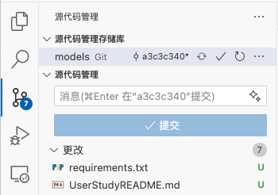

# 用户实验介绍

## 环境配置
请通过以下命令配置环境，用于测试编辑结果：
```bash
conda create --name user_study_keras python=3.7 -y
conda activate user_study_keras
pip install tensorflow==1.15.0
pip install scipy
pip install protobuf==3.20.*
```

如果你的环境还不是 `user_study_keras`，请通过以下命令激活环境：
```bash
conda activate user_study_keras
```
请在 `user_study_keras` 环境下完成实验。

## 任务介绍
`Dropout` 作为 Keras 中的前端层，用于定义神经网络结构。我们希望为 `Dropout` 类添加初始化参数 `noise_shape` 和 `seed`，请将这两个参数传入后端的 `Dropout` 函数， 文件 `keras/layers/core.py` 中，补充了两个新参数的描述文档，如图所示：


你可以复制以下文档，完成所示的首个编辑：
```python
        noise_shape: 1D integer tensor representing the shape of the
            binary dropout mask that will be multiplied with the input.
            For instance, if your inputs have shape
            `(batch_size, timesteps, features)` and
            you want the dropout mask to be the same for all timesteps,
            you can use `noise_shape=(batch_size, 1, features)`.
        seed: A Python integer to use as random seed.
```

请你在完成所示修改后，继续对项目进行 **另外 4 处** 修改。你可以打开源代码管理工具，查看修改的数量，确保你确实完成了 4 处修改，如图所示：



如果你觉得修改的次数不够，可以继续修改，直到实现编辑目标（即通过 [验证修改](#验证修改) 中的测试）

## 温馨提示
* 后端的 `dropout` 函数签名为：
```python
def dropout(x, level, noise_shape=None, seed=None):
```
* 请不要修改无关内容，例如美化代码格式

## 验证修改

请通过以下命令验证修改：
```bash
python -m test.test
```

如果修改正确，你会看到以下输出：
```bash
Using TensorFlow backend.
Test 1 passed
Test 2 passed
Test 3 passed
```

当你看到以上输出时，说明你已经完成了任务。
